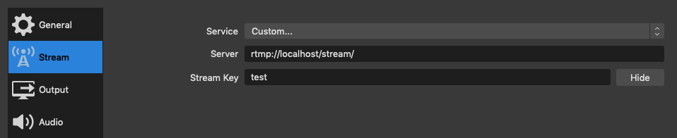

# connect-sion

Aplicación multicanal para realizar interpretaciones en la IDMJI. .

## Requirements

- Docker
- Docker composer
- OBS
- VLS (for debugging streaming connection)
- npm (for debugging frontend)

## Usage

### Debugging

1. Run streaming server

```bash
docker-compose up --build server
```

2. Start OBS streaming with custom stream to `rtmp://localhost/stream` and
   stream key `test` (this actually can be any value, but should match with
   `REACT_APP_STREAM` for the frontend)



3. Run frontend server

```bash
cd frontend
npm start
```

### General deployment

Run front and servers with docker-compose

```bash
docker-compose up --build
```

Check the OBS configuration described in the debugging section

## License

[MIT](./LICENSE)
